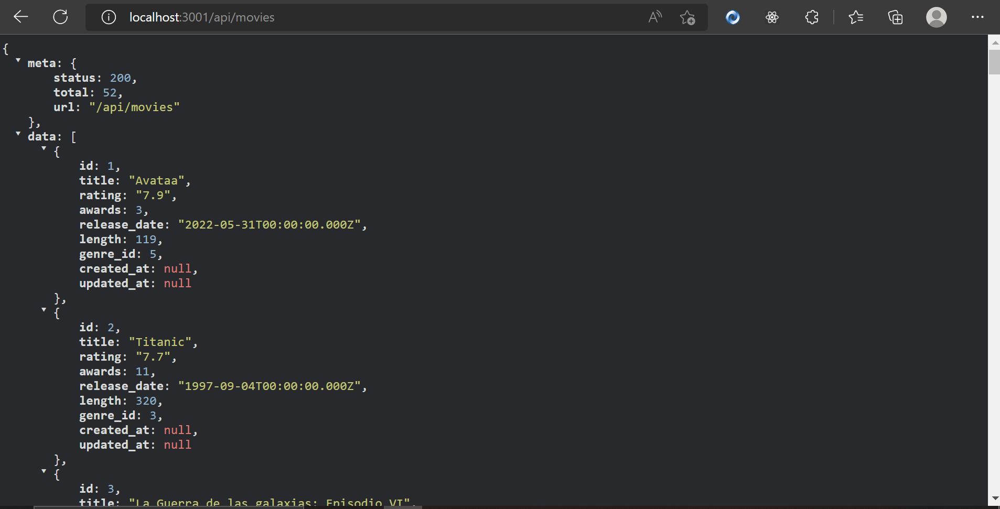
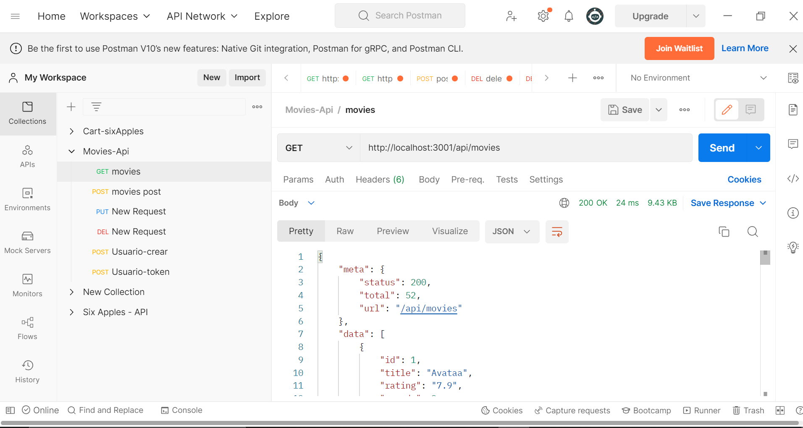

### Apis  
#### API es una abreviatura de Application Programming Interfaces, o interfaz de programación de aplicaciones. Las API son mecanismos que permiten a dos componentes de software comunicarse entre sí mediante un conjunto de definiciones y protocolos.
#### Básicamente una API no es visible al usuario. Más bien, los resultados de consumir dicha API son los que se muestran al usuario. Son circuitos internos visibles para el desarrollador y que puede conectar para hacer funcionar una herramienta. 
#### En esta práctica creamos nuestras propias APIs, y para ver que todo funcione correctamente, las testeamos en Postman.
#### Api desde el navegador: 

#### Testing de Api en Postman:

